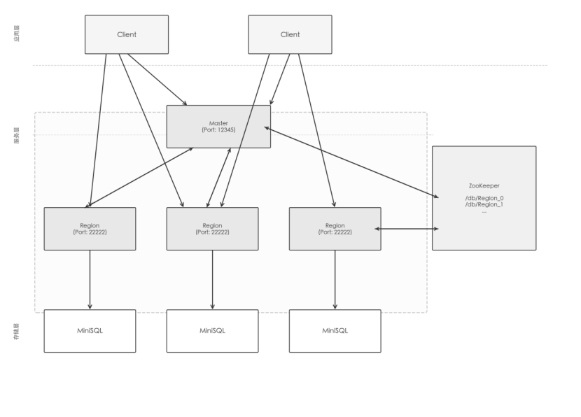

# 分布式 miniSQL 系统总体设计报告

组员：施志煊，胡启宇

## 1. 项目背景与目标

### 1.1 背景

miniSQL 是一个已实现的单机关系型数据库，支持基本的 SQL 语句和 B+ 树索引。本项目的目标是在其基础上，构建一套分布式数据库系统，使其具备水平扩展、高可用和容错能力。

### 1.2 功能需求

| 类别 | 需求描述 |
| --- | --- |
| SQL 支持 | CREATE/DROP TABLE、CREATE/DROP INDEX、SELECT、INSERT、DELETE |
| 分布式部署 | 数据分布在多台 RegionServer 上，对客户端透明 |
| 高可用 | 每张表维护 2 个副本（主副），任意一个节点宕机不丢数据 |
| 容错容灾 | 节点宕机后自动将数据迁移到其他健康节点 |
| 负载均衡 | 新建表时自动选择负载最低的节点 |
| 服务发现 | 节点动态上下线，系统自动感知、无需人工干预 |

### 1.3 非功能需求

- 各节点独立部署在不同物理机上，通过局域网通信
- 客户端使用体验尽量与单机版 miniSQL 一致（输入 SQL，得到结果）
- 系统具备基本的可扩展性，支持增减 RegionServer 节点

## 2. 整体架构设计

### 2.1 架构风格

采用主从式（Master-Slave）架构，参考 HBase 设计思路：

- 一个 MasterServer 负责元数据管理和集群协调，不存储实际数据
- 多个 RegionServer 作为数据节点，每个节点内嵌一套 miniSQL 引擎
- ZooKeeper 作为第三方协调服务，负责 RegionServer 的服务注册与健康检测
- Client 通过两步路由与系统交互

### 2.2 架构图


### 2.3 系统启动顺序

1. 启动 ZooKeeper 集群
2. 启动 MasterServer（连接 ZK，开始监听客户端和 Region 连接）
3. 启动各 RegionServer（向 ZK 注册，向 Master 上报本地已有的表）
4. 启动 Client（连接 Master，开始接受用户输入）

## 3. 模块职责划分

### 3.1 miniSQL（单机引擎，作为库被 RegionServer 引用）

负责单节点上的所有数据存储操作，对外暴露两个入口：

- Interpreter.interpret(sql) —— 接收 SQL 字符串，解析并执行，返回结果字符串
- API —— 供内部各 Manager 调用的统一接口

内部分层：

```
Interpreter（解析）→ API（协调）→ [BufferManager / CatalogManager / IndexManager / RecordManager]
```

| 子模块 | 职责 |
| --- | --- |
| Interpreter | SQL 词法/语法分析，调用 API |
| API | 统一封装增删查改流程（索引联动、catalog 更新） |
| BufferManager | 磁盘块缓冲，减少 I/O |
| CatalogManager | 表和索引的元数据管理，持久化到本地文件 |
| IndexManager | B+ 树索引的创建、查找、插入、删除 |
| RecordManager | 记录的物理存储与检索 |

### 3.2 MasterServer（主节点）

不存储任何数据行，只维护集群元数据：

| 子模块 | 职责 |
| --- | --- |
| ZookeeperManager | 连接 ZK，监听 `/db` 目录的子节点变化 |
| ServiceMonitor | ZK 事件回调，分发给策略执行器 |
| ServiceStrategyExecutor | 处理节点上线（ADD）、宕机（INVALID）、恢复（RECOVER）三种策略 |
| TableManager | 内存数据结构：维护「表→Region IP」路由表、「Region→表列表」负载表 |
| SocketManager | 监听 TCP 12345，为每个连接（Client 或 Region）创建独立线程 |
| ClientCMD | 处理客户端查询路由请求，返回目标 Region IP |
| RegionCMD | 处理 Region 上报的表变更通知，更新 TableManager |

### 3.3 RegionServer（从节点）

数据存储与 SQL 执行的核心节点：

| 子模块 | 职责 |
| --- | --- |
| ZookeeperServiceManager | 向 ZK 注册临时节点，维持心跳 |
| DatabaseManager | 启动时从本地 CatalogManager 加载已有表信息 |
| MasterSocketManager | 与 Master 保持长连接，接收并执行 Master 下发的管控命令 |
| ClientSocketManager | 监听 TCP 22222，接受 Client 连接，每连接一个处理线程 |
| RegionSocketSendManager | 按需：向目标 Region 推送数据文件（容灾迁移） |
| RegionSocketReceiveManager | 监听来自其他 Region 的数据文件推送 |
| FtpUtils | 文件上传/下载，用于副本数据的远程备份与恢复 |

### 3.4 Client（客户端）

对用户屏蔽分布式细节，提供类单机的使用体验：

| 子模块 | 职责 |
| --- | --- |
| ClientManager | 主循环：读取 SQL → 解析表名 → 查缓存/查 Master → 发给 Region |
| CacheManager | 本地缓存「表名 → Region IP」，避免每次都查 Master |
| MasterSocketManager | 与 Master 通信，查询目标 Region 的 IP |
| RegionSocketManager | 与 Region 建立连接，发送 SQL，接收结果 |

## 4. 关键设计决策

### 4.1 为什么用 MasterServer 而不是完全去中心化？

分布式元数据管理的主流方案有两类：中心化（如 HBase 的 HMaster）和去中心化（如一致性哈希）。

本项目选择中心化 MasterServer，原因：

- 实现简单，元数据路由逻辑集中在一处
- 表的数量不大，Master 不会成为瓶颈
- 去中心化方案（如 Gossip、Raft）实现复杂度远超项目要求

Master 的单点故障问题在本项目中暂不考虑（作为 known limitation）。

### 4.2 副本策略：每表固定 2 副本

每张表维护 1 主 + 1 副共 2 个副本：

- 能容忍 1 个节点宕机而不丢数据
- 写操作由客户端同时发往主副两个节点（客户端双写）
- 读操作只发往主节点，降低读放大

没有采用 Quorum 多数写，原因是实现成本高且 2 副本场景下 Quorum 无意义。

### 4.3 服务发现：借助 ZooKeeper 临时节点

RegionServer 注册临时（EPHEMERAL）节点，Session 断开后节点自动删除。

Master 通过 PathChildrenCacheListener 感知上下线，无需轮询。

此方案成熟可靠，是 HBase/Kafka 等系统的常见做法。

### 4.4 容灾数据迁移：SQL 日志重放

数据文件迁移方案选择 SQL 日志重放：

- 每个 Region 将执行过的写操作 SQL（INSERT/DELETE/CREATE）追加写入 `<表名>.txt`
- 迁移时，源 Region 将该文件传给目标 Region，目标 Region 重放 SQL 重建数据
- 优点：实现简单，无需序列化二进制数据格式
- 缺点：大量记录时重放性能差（作为 known limitation）

### 4.5 两步路由：Client 先查 Master，再直连 Region

```
Client → Master（查 IP）→ Region（执行 SQL）
```

相比"所有请求都经过 Master 转发"，两步路由避免 Master 成为数据链路瓶颈，只让 Master 承担轻量的元数据查询。

客户端本地还维护了路由缓存，命中则直接跳过 Master，进一步降低延迟。

## 5. 模块间接口设计

### 5.1 Client ↔ MasterServer 通信协议

统一使用文本行协议（每条消息以 \n 结尾）：

| 客户端发送 | Master 响应 | 说明 |
| --- | --- | --- |
| `[client] create <table>` | `[master] create <主IP> <副IP> <table>` | 查询建表应发往哪 2 个节点 |
| `[client] select <table>` | `[master] select <主IP> <副IP> <table>` | 查询读操作路由 |
| `[client] insert <table>` | `[master] insert <主IP> <副IP> <table>` | 查询写操作路由 |
| `[client] drop <table>` | `[master] drop <主IP> <副IP> <table>` | 同上 |
| `[client] show tables` | `[master] show <t1> <t2> ...` | 展示所有表名 |

### 5.2 RegionServer ↔ MasterServer 通信协议

#### Region 发送给 Master

| Region 发送 | 含义 |
| --- | --- |
| `[region] recover <t1> <t2> ...` | 启动/重连时上报本节点已有的表 |
| `[region] create <table>` | 通知 Master 本节点新增了一张表 |
| `[region] drop <table>` | 通知 Master 本节点删除了一张表 |

#### Master 发送给 Region

| Master 发送 | 含义 |
| --- | --- |
| `[master] recover` | 命令该节点清空本地所有数据后重新上线 |
| `[master] copy <targetIP> <table>.txt` | 命令该节点将数据文件推送至目标节点 |

### 5.3 Client ↔ RegionServer

直接发送 SQL 字符串（以 ;; 结尾，与单机版格式对齐），Region 返回执行结果纯文本。

### 5.4 RegionServer ↔ RegionServer（数据迁移）

- 发送方（RegionSocketSendManager）：通过 TCP 将 `<table>.txt` 文件内容逐行发送至目标 Region 的 1117 端口
- 接收方（RegionSocketReceiveManager）：逐行接收并重放 SQL

## 6. 分布式核心机制设计

### 6.1 服务发现与健康检测

```
RegionServer 启动
    └── 在 ZK /db/ 下创建临时节点 Region_N，值为本机 IP
    └── 节点宕机/网络断开 → ZK Session 超时 → 临时节点自动删除
    └── MasterServer 监听 /db 目录 → 触发 CHILD_ADDED / CHILD_REMOVED 事件
```

### 6.2 负载均衡策略

建表时，Master 从当前存活的 Region 列表中，选取已管理表数最少的 2 个节点作为主副副本节点。

这是一种静态的、基于表数量的简单均衡策略，不感知实际的 CPU/内存/磁盘负载。

### 6.3 容灾流程（节点宕机）

```
RegionServer A 宕机
    ↓
ZK 临时节点消失，Master 收到 CHILD_REMOVED 事件
    ↓
Master 遍历 A 所管理的每张表 T：
    ├── 找到 T 的另一副本节点 B
    ├── 找到当前负载最低的健康节点 C（不是 A 也不是 B）
    ├── 向 B 发送：[master] copy <C的IP> <T>.txt
    │       B 将 T.txt 推送给 C，C 重放 SQL 恢复数据
    └── 更新路由表：T 的副本从 A → C
```

### 6.4 节点恢复流程

```
RegionServer A 重新上线
    ↓
ZK 临时节点重新出现，Master 收到 CHILD_ADDED 事件
    ↓
判断：A 是否曾经出现过？
    ├── 首次出现（新节点）→ ADD 策略：加入集群，发 recover 清空本地旧数据
    └── 再次出现（恢复）  → RECOVER 策略：发 recover，A 清空本地数据重新待命
```

### 6.5 路由缓存一致性

客户端本地缓存表→IP 映射，在以下情况需要失效重查：

- 连接 Region 失败（拒绝连接）：退回查 Master 获取最新路由
- DROP TABLE 操作后：主动清除本地缓存

## 7. 技术选型

| 功能 | 选型 | 理由 |
| --- | --- | --- |
| 开发语言 | Java 8 | 生态成熟，与 ZooKeeper/Curator 官方库兼容 |
| 构建工具 | Maven | 标准 Java 项目依赖管理 |
| 服务发现 | ZooKeeper 3.8 + Curator 5.1 | 业界标准，临时节点机制天然支持健康检测 |
| 节点间通信 | Java 原生 Socket | 足够简单，无需引入 RPC 框架 |
| 文件传输（容灾） | Apache Commons Net (FTP) + TCP Socket | FTP 用于全量备份，Socket 用于增量日志推送 |
| 日志/工具 | Lombok, Log4j, Guava | 减少样板代码，便于调试 |

## 8. 团队分工

| 团队成员 | 团队分工 |
| --- | --- |
| 胡启宇 | 负责 MasterServer 和 Client 的编写 |
| 施志煊 | 负责 RegionServer 和 miniSQL 的编写 |

## 9. 开发周期

4.20-4.25 设计与框架搭建阶段

- 明确项目目标，完成详细设计文档。
- 创建代码仓库并建立版本管理规范，确保协作有序。
- 明确各模块功能与接口，完成项目主框架和各模块的基础代码结构搭建。

4.26-5.17 开发阶段

- 团队成员根据分工，分别实现各自负责的模块功能。
- 各模块同步进行单元测试，及时修正和完善功能，实现自测通过。
- 定期团队内部同步进度，及时解决开发过程中的技术问题。

5.18-5.22 联合调试与发布阶段

- 完成所有模块的集成，对整个系统进行联合调试，解决模块间接口与协作问题。
- 整理并完善系统的总体设计文档与各模块详细设计文档。
- 准备项目演示相关材料，包括演示PPT和演示视频。
- 完成最终系统的发布与部署。